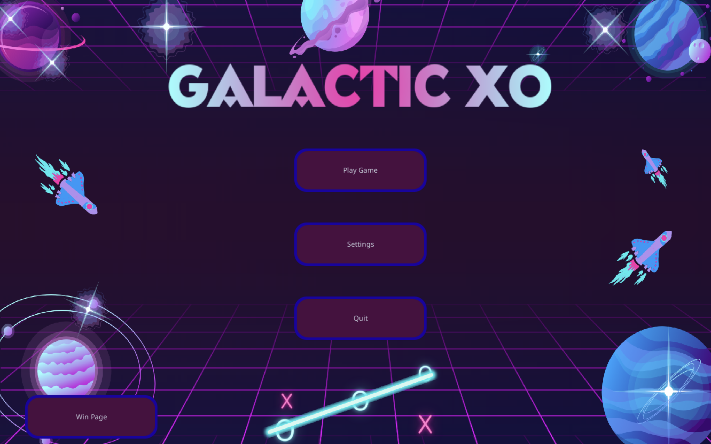
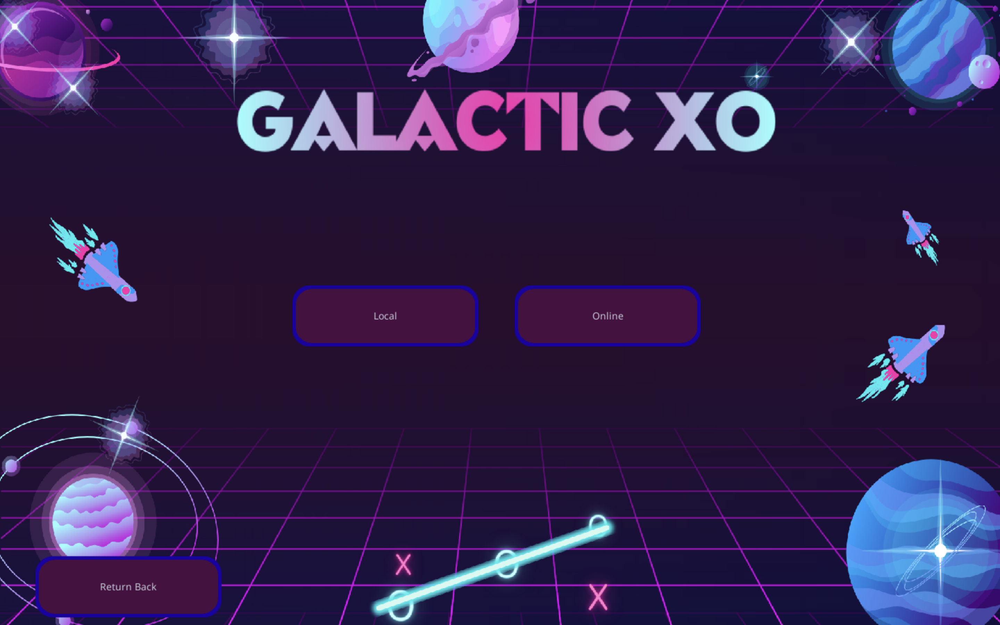
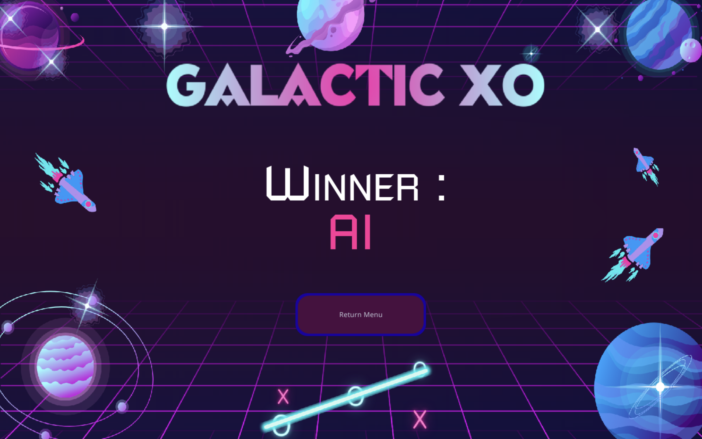

# Galactic XO – Ultimate Tic-Tac-Toe avec IA Minimax

## Description
**Galactic XO** est une implémentation du jeu **Ultimate Tic-Tac-Toe**, une version avancée du morpion classique, dotée d’une **interface graphique immersive** développée avec **Pygame**.

Le jeu permet de jouer :
- en local ou en ligne (client / serveur)
- en joueur contre joueur ou joueur contre IA

L’intelligence artificielle repose sur l’algorithme **Minimax**, permettant à l’IA de prendre des décisions optimales.

---

## Aperçu de l’interface

### Menu principal


### Choix du mode de partie
Sélection entre une partie **locale** ou **en ligne**.


### Sélection du type de joueurs
Choix entre **Player vs Player** et **Player vs AI**.


### Écran de victoire
Affichage du vainqueur en fin de partie.


---

## Fonctionnalités
- Implémentation complète de l’**Ultimate Tic-Tac-Toe**
- Interface graphique interactive
- IA basée sur l’algorithme **Minimax**
- Mode multijoueur en ligne (host / guest)
- Optimisation des calculs par **mémoïsation**

---

## Intelligence Artificielle
L’IA est implémentée dans le fichier `AIminimaxV1.py`.

Elle utilise :
- un algorithme **Minimax récursif**
- une profondeur de recherche contrôlée
- une fonction d’évaluation des états du plateau
- une mémoïsation des états pour améliorer les performances

---

## Installation et exécution

### 1. Installation des dépendances
```bash
pip install pygame pygame_gui numpy
```
### 2. Lancement du jeu
```bash
python menu.py
```
Le menu permet de choisir le mode de jeu, le type de joueurs et, le cas échéant, d’héberger ou de rejoindre une partie en ligne.

## Règles du jeu
- Le plateau principal est composé de 9 sous-plateaux
- Le coup joué impose le sous-plateau du tour suivant
- Un sous-plateau gagné est verrouillé
- L’alignement de 3 sous-plateaux gagnés permet de remporter la partie

## Auteurs
- Maëla Brelivet
- Lucas Delhommeau
- Wissam Mecherfi
- Nour El Habib
  
Étudiants ingénieurs à EURECOM

## Améliorations possibles
- Fonction heuristique plus avancée
- IA avec niveaux de difficulté
- Sauvegarde et reprise de parties
- Mode tournoi
- Optimisation Minimax avec Alpha-Beta pruning
